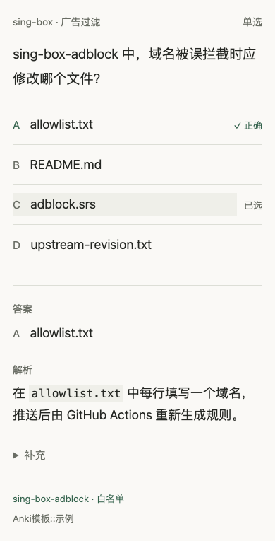
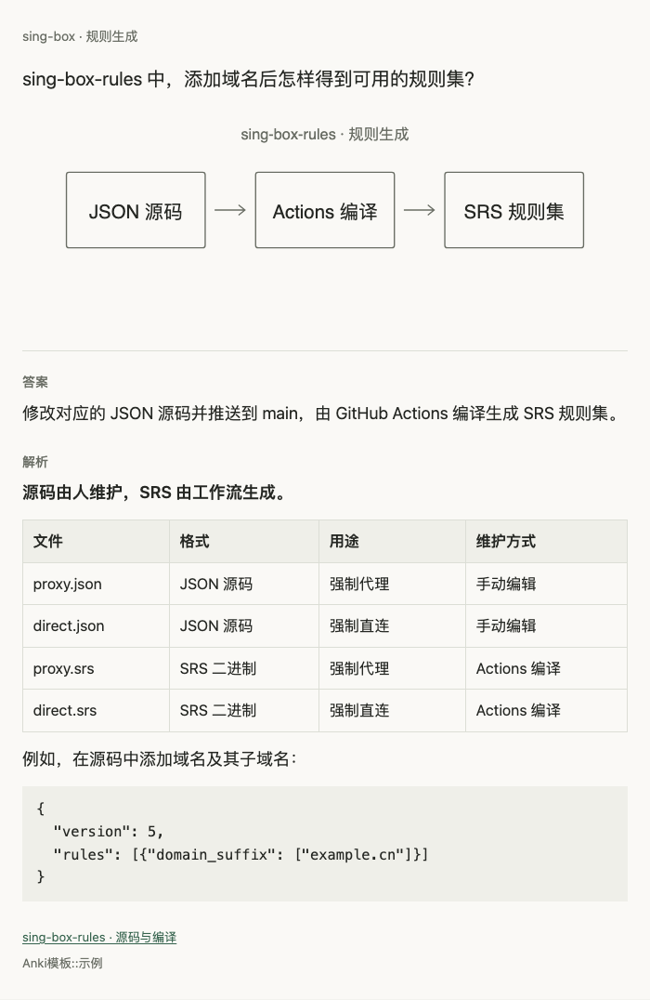

# Anki 模板

个人日常复习用的 Anki 模板，支持问答、选择、填空和原生图片遮挡。

[下载安装包](https://zzpice.github.io/anki-template/downloads/anki-template.apkg) · [在线预览](https://zzpice.github.io/anki-template/)

[](https://github.com/zzpice/anki-template/actions/workflows/check.yml)

## 开始使用

1. 下载 `.apkg`，在 Anki Desktop 中通过「文件 → 导入」打开。四个笔记类型、媒体和「Anki 模板 · 示例」牌组会一起导入。
2. 点击「添加」，选择自己的牌组，再选择下面介绍的笔记类型，填写字段并添加。

可以先在「浏览」中查看示例的字段，或直接复习示例牌组。示例可删除；使用手机或 AnkiWeb 时，先在客户端导入，再同步。建议使用当前稳定版客户端，图片遮挡需要原生遮挡支持。

## 填写卡片

### 问答

`问题` 填题干，`答案` 填翻面后要核对的内容。例如：

- 问题：sing-box 中，domain 和 domain_suffix 的匹配范围有什么区别？
- 答案：domain 精确匹配完整域名；domain_suffix 匹配指定域名及其子域名。

### 选择

单选、多选、判断共用这个类型。`问题` 填题干，`选项` 用 `||` 分隔 2～26 项，不用自行加字母；`答案` 按**录入顺序**填写正确选项字母。下面各行对应同名字段。

单选：`题型` 留空或填 `单选`。

```text
问题：sing-box-adblock 中，域名被误拦截时应修改哪个文件？
选项：adblock.srs||upstream-revision.txt||allowlist.txt||README.md
答案：C
题型：单选
```

多选：`题型` 填 `多选`，答案字母连写。

```text
问题：哪些做法有助于 RouterOS 正常加载 HTTPS Adlist？
选项：检查设备时间||启用可信 CA 或导入所需证书||长期关闭证书校验||检查 DNS 缓存是否有足够空间
答案：ABD
题型：多选
```

判断：`题型` 填 `判断`，使用 `正确||错误`，答案为 `A` 或 `B`。

```text
问题：assets 离线时，仍可下载尚未缓存的原图。
选项：正确||错误
答案：B
题型：判断
```

单选、多选每次复习随机排序，判断保持原顺序；在标签栏添加 `固定顺序` 可让个别题目不随机。随机后显示字母会变化，答案字段仍按录入顺序填写。背面同时标出已选项和正确答案，换卡时清除临时选择，复习评分由你决定。



### 填空

在 `正文` 输入内容，选中文字后点击 Anki 的 `[…]` 按钮，也可直接填写：

```text
资金守恒：调整后总额 = {{c1::当前总额}} + {{c2::资金变动}}；买入 − 卖出 = {{c2::资金变动}}。
{{c3::新增::正负方向}}资金为正，取出资金为负。
```

这个示例生成三张卡片：不同编号分卡，相同编号一起遮住；`::正负方向` 是正面的提示。填空不用另填答案，也可用于一段文字中的多个空。

### 图片遮挡

选择「图片遮挡」类型，点击「选择图片」或从剪贴板粘贴图片，在 Anki 内置编辑器中框出要遮住的区域，再添加笔记。独立遮挡或分组分别生成卡片。

`Header` 填题干，`Back Extra` 填背面解析，`Comments` 填可折叠的补充。`Image` 和 `Occlusion` 由编辑器维护，不用手写。示例用规则生成流程图遮住输入和输出；普通浏览器预览只显示导入提示。

### 可选信息

问答、选择和填空还可以填写以下字段；不需要的留空即可。

| 字段 | 填什么 / 显示位置 |
| --- | --- |
| 解析 | 原因、推导或易错点，背面直接显示 |
| 补充 | 较长资料或个人笔记，背面默认折叠 |
| 章节 | 主题或章节名，卡片顶部显示 |
| 来源 | 出处文字或 HTML 链接，背面底部显示 |

标签在编辑器底部的标签栏填写，多个标签用空格分隔，各类型均在背面显示。

## 内容格式

字段使用 Anki / HTML 富文本。可以用编辑器加粗、添加列表、插入图片，或从网页粘贴富文本；模板本身不解析 Markdown。普通图片可点击放大，宽表格和代码块在窄屏下可左右滚动。浅深色跟随客户端或系统外观，卡片可离线使用。

表格、代码块和链接可在字段的 `</>` HTML 编辑器中填写，例如：

```html
<pre><code>{ "domain_suffix": ["example.cn"] }</code></pre>
<a href="https://github.com/zzpice/sing-box-rules">规则来源</a>
```



示例来自 [sing-box-rules](https://github.com/zzpice/sing-box-rules)、[sing-box-adblock](https://github.com/zzpice/sing-box-adblock)、[routeros-adlist](https://github.com/zzpice/routeros-adlist)、[assets](https://github.com/zzpice/assets)、[zashboard-config](https://github.com/zzpice/zashboard-config) 和 [zp-folio](https://github.com/zzpice/zp-folio) 的公开说明。安装包、在线预览和上面的截图使用同一批示例。

## 修改与维护

更新时重新导入安装包。想自行修改并保留样式，可先在 Anki 中复制笔记类型，再在「卡片」窗口编辑模板。

源码字段见 `note-types.json`，模板在 `templates/`，样式在 `style.css`，示例在 `samples.json`。手动安装、生成安装包、测试和截图更新见 [维护说明](DEVELOPMENT.md)。

## 许可

[MIT](LICENSE)
